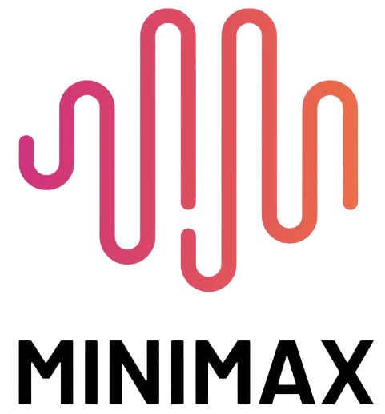

<p align="center">
  
</p>

<h1 align="center">FreeHive</h1>

<p align="center">
  <strong>One app. Every frontier AI model. Zero API keys.</strong>
</p>

<p align="center">
  <em>Free, local-first desktop app that gives you unified API access to Claude, ChatGPT, Gemini, and 150+ Arena models — using your existing accounts. No billing required.</em>
</p>

<p align="center">
  
  
  
  
  
</p>

---

## What is FreeHive?

FreeHive is a **local API server + chat UI** that turns your free AI accounts into a fully functional, drop-in replacement for the OpenAI and Anthropic APIs.

Instead of paying for API keys, FreeHive uses the OAuth tokens from the official CLI tools (Claude Code, Codex CLI, Gemini CLI) to talk directly to provider APIs — the same way the CLIs themselves do. You get full model access, tool calling, streaming, and extended thinking, all running on `localhost`.

**Point any tool at `http://localhost:7200` and it just works.**

<p align="center">
  
  &nbsp;&nbsp;
  
  &nbsp;&nbsp;
  
  &nbsp;&nbsp;
  
  &nbsp;&nbsp;
  
  &nbsp;&nbsp;
  
  &nbsp;&nbsp;
  
  &nbsp;&nbsp;
  
  &nbsp;&nbsp;
  
  &nbsp;&nbsp;
  
</p>

---

## Why FreeHive?

| Problem | FreeHive Solution |
|---------|-------------------|
| API keys cost money | Uses your free account OAuth tokens — $0 |
| Each AI has its own app/UI | One unified chat interface for all providers |
| Can't use free accounts with dev tools | Drop-in OpenAI & Anthropic API compatibility |
| Chat history scattered across services | All conversations stored locally in SQLite |
| No programmatic access without billing | Full REST API on localhost, works with any SDK |
| Limited to 3-4 providers | 150+ models via Arena.ai Chrome extension bridge |

---

## Supported Providers & Models

### Direct Providers (Protocol-Level Access)

<table>
<tr>
<td align="center" width="200">
  <br/>
  <strong>Claude</strong><br/>
  <sub>via Anthropic API + OAuth</sub>
</td>
<td>

- `claude-sonnet-4-6` / `claude-opus-4-6`
- `claude-sonnet-4-5` / `claude-haiku-4-5`
- Auto token refresh, streaming, tool calling
- Extended thinking (low / medium / high)
- Auth: `~/.claude/.credentials.json`

</td>
</tr>
<tr>
<td align="center">
  <br/>
  <strong>ChatGPT</strong><br/>
  <sub>via WebSocket (Codex protocol)</sub>
</td>
<td>

- `gpt-5.4` / `gpt-5.4-mini` / `gpt-5.2`
- `gpt-5.3-codex` / `o1` / `o3` / `o4` series
- Persistent WebSocket — sub-second turn latency
- Full tool calling, reasoning mode
- Auth: `~/.codex/auth.json`

</td>
</tr>
<tr>
<td align="center">
  <br/>
  <strong>Gemini</strong><br/>
  <sub>via Code Assist API</sub>
</td>
<td>

- `gemini-3-flash-preview` / `gemini-3-pro-preview`
- `gemini-3.1-pro-preview` / `gemini-2.5-pro`
- `gemini-2.5-flash` / `gemini-2.5-flash-lite`
- 1M token context, tool calling, thinking mode
- Auth: `~/.gemini/oauth_creds.json`

</td>
</tr>
</table>

### Arena Models (150+ via Chrome Extension Bridge)

<p>
  
  Access every model on <strong>LMSYS Chatbot Arena</strong> — including models not available through any API:
</p>

<table>
<tr>
<td> OpenAI</td>
<td> Claude</td>
<td> Gemini</td>
<td> Grok</td>
<td> DeepSeek</td>
</tr>
<tr>
<td> Qwen</td>
<td> Mistral</td>
<td> GLM</td>
<td> Kimi</td>
<td> MiniMax</td>
</tr>
</table>

Arena models are accessed via `arena/model-name` prefix (e.g., `arena/gpt-5.2`, `arena/gemini-2.5-flash`).

---

## Features

### Drop-In API Compatibility

FreeHive exposes two API endpoints that any existing tool can point at without code changes:

| Endpoint | Format | Used By |
|----------|--------|---------|
| `POST /v1/messages` | Anthropic Messages API | Claude Code, OpenClaude, Anthropic SDK |
| `POST /v1/chat/completions` | OpenAI Chat Completions API | Cursor, Continue.dev, OpenCode, OpenAI SDK |
| `GET /v1/models` | OpenAI Models list | Model discovery for any client |

### Tool / Function Calling

Full round-trip tool calling works across all three direct providers and Arena:

- **Claude** — native pass-through to Anthropic API
- **ChatGPT** — format conversion via WebSocket Responses API
- **Gemini** — tools injected into Code Assist API format
- **Arena** — tool definitions serialized as XML prompt injection, parsed from response

### Extended Thinking / Reasoning

Control thinking effort per-request or globally:

```
# Via model name suffix
claude-sonnet-4-6-think-high

# Via request body
{"thinking_effort": "medium"}

# Via UI toggle
[Off] [Lo] [Med] [Hi]
```

Supported: Claude (all models), Gemini (2.5+, 3.x), ChatGPT (o-series, gpt-5.3+)

### Chat Persistence

- All conversations saved to `~/.freehive/conversations.db` (SQLite)
- Both UI chats and API traffic are persisted
- Saved chats panel with click-to-restore
- Auto-restore most recent chat on startup
- Export all conversations as JSON

### Dynamic Model Discovery

On startup and after authentication, FreeHive queries each provider for their current model catalog. No hardcoded model lists — you always see what's actually available to your account.

### Smart API Key Routing

Your API key determines the model — no need to configure model names in your tools:

```
freehive-claude-sonnet-4-6  → Claude Sonnet 4.6
freehive-gpt-5.2            → GPT-5.2
freehive-gemini-3-flash-preview → Gemini 3 Flash
```

Provider shortcuts also work: `freehive-claude`, `freehive-chatgpt`, `freehive-gemini`

---

## Quick Start

### 1. Clone & Install

```bash
git clone https://github.com/user/freehive.git
cd freehive

# Python backend
python3 -m venv venv
source venv/bin/activate
pip install -r requirements.txt

# Frontend
npm install
```

### 2. Start FreeHive

```bash
./start.sh
```

Or manually:

```bash
# Terminal 1 — Backend
source venv/bin/activate
uvicorn backend.main:app --host 127.0.0.1 --port 7200 --reload

# Terminal 2 — Frontend
npm run dev
```

### 3. Authenticate

Open `http://localhost:5173` — the setup screen walks you through installing and authenticating CLI tools:

| Tool | Command | What it unlocks |
|------|---------|-----------------|
| Claude Code | `npm i -g @anthropic-ai/claude-code` | Claude models (Pro sub required) |
| OpenClaude | `npm i -g @gitlawb/openclaude` | Claude models (free account works) |
| Gemini CLI | `npm i -g @google/gemini-cli` | Gemini models (free) |
| Codex CLI | `npm i -g @openai/codex` | ChatGPT / GPT models (free) |

### 4. Use It

**FreeHive UI:** `http://localhost:5173`
**API Server:** `http://localhost:7200`

```bash
# Verify it's running
curl http://localhost:7200/v1/models -H "x-api-key: freehive"
```

---

## Connect Your Tools

### Claude Code / OpenClaude

```bash
export ANTHROPIC_BASE_URL=http://localhost:7200
export ANTHROPIC_API_KEY=freehive-claude-sonnet-4-6
```

### Cursor / Continue.dev / Windsurf


```
Base URL:  http://localhost:7200/v1
API Key:   freehive-gpt-5.2
Model:     gpt-5.2
```

### Python — Anthropic SDK

```python
import anthropic

client = anthropic.Anthropic(
    base_url="http://localhost:7200",
    api_key="freehive-claude-sonnet-4-6",
)

response = client.messages.create(
    model="claude-sonnet-4-6",
    max_tokens=1024,
    messages=[{"role": "user", "content": "Hello!"}],
)
```

### Python — OpenAI SDK

```python
from openai import OpenAI

client = OpenAI(
    base_url="http://localhost:7200/v1",
    api_key="freehive-gpt-5.2",
)

response = client.chat.completions.create(
    model="gpt-5.2",
    messages=[{"role": "user", "content": "Hello!"}],
)
```

### OpenCode

One-click: go to **Settings > API Keys > Add to OpenCode** in the FreeHive UI.

Or manually add to `~/.config/opencode/opencode.json`:

```json
{
  "providers": {
    "freehive-claude": {
      "id": "@ai-sdk/openai-compatible",
      "options": {
        "baseURL": "http://127.0.0.1:7200/v1",
        "apiKey": "freehive-claude"
      }
    }
  }
}
```

---

## Arena Setup (150+ Models)

Arena access requires a Chrome extension that bridges FreeHive to LMSYS Chatbot Arena.

```bash
# One-command setup
./scripts/setup_arena_bridge.sh
```

Or use the **Arena panel** in the FreeHive UI for guided setup.

Once connected, Arena models appear in the sidebar and are accessible via the API:

```bash
# Use any Arena model via the API
curl -X POST http://localhost:7200/v1/chat/completions \
  -H "Content-Type: application/json" \
  -H "x-api-key: freehive-arena" \
  -d '{"model": "arena/gemini-2.5-flash", "messages": [{"role": "user", "content": "Hi"}]}'
```

**Features:**
- Smart reCAPTCHA token management (auto-refresh every 90s)
- Per-model health tracking with adaptive rate limiting
- Model probe: test all 150+ models in one click
- Provider card grid with search, filters, and capability tags

---

## Architecture

```
                          +-----------------------+
                          |    FreeHive Chat UI    |
                          |   (SvelteKit + Vite)   |
                          |   localhost:5173        |
                          +-----------+-----------+
                                      |
                                      v
                    +----------------------------------+
                    |        FastAPI Backend            |
                    |        localhost:7200             |
                    |                                  |
                    |  /v1/messages    (Anthropic API)  |
                    |  /v1/chat/completions (OpenAI API)|
                    |  /api/*          (FreeHive API)   |
                    +-----+--------+--------+----+-----+
                          |        |        |    |
                    +-----+  +-----+  +-----+  ++-------+
                    |        |        |         |        |
               +----v---+ +-v------+ +-v-----+ +v-------+--+
               | Claude | |ChatGPT | |Gemini | |   Arena   |
               | Direct | | Direct | |Direct | |  Bridge   |
               |Adapter | |Adapter | |Adapter| |  Adapter  |
               +----+---+ +---+----+ +---+---+ +-----+-----+
                    |          |          |            |
                    v          v          v            v
              Anthropic    ChatGPT    Cloud Code   Chrome Ext
              REST API    WebSocket   Assist API   → arena.ai
              (OAuth)     (OAuth)     (OAuth)      (150+ models)
```

### Tech Stack

| Layer | Technology |
|-------|-----------|
| Desktop | Tauri v2 (Rust) |
| Frontend | SvelteKit 2 + Svelte 5 + Vite |
| Backend | Python FastAPI + uvicorn |
| Database | SQLite (local) |
| Auth | OAuth tokens from provider CLIs |
| Arena Bridge | Chrome Extension (Manifest V3) + Native Messaging Host |

---

## Data & Privacy

Everything stays on your machine. FreeHive stores:

| File | Purpose |
|------|---------|
| `~/.freehive/conversations.db` | Chat history (SQLite) |
| `~/.freehive/config.json` | Settings, model cache, thinking preference |
| `~/.freehive/arena_models_full_cache.json` | Arena model catalog (158 models) |
| `~/.freehive/arena_model_health.json` | Per-model success/failure tracking |

Auth tokens are read from (never written to):

| File | Written by |
|------|-----------|
| `~/.claude/.credentials.json` | Claude Code / OpenClaude CLI |
| `~/.codex/auth.json` | Codex CLI |
| `~/.gemini/oauth_creds.json` | Gemini CLI |

**FreeHive never sends your data to any server it doesn't need to.** All API calls go directly to the provider endpoints. No analytics, no telemetry, no cloud backend.

---

## Build Desktop App

Build the Tauri desktop installer (must build on target OS):

```bash
npm run tauri build
```

This bundles:
- Frontend build
- Backend sidecar (`freehive-backend` binary via PyInstaller)
- Platform-specific installer (.deb, .rpm, .dmg, .exe)

Linux only:
```bash
npm run tauri build -- --bundles deb,rpm
```

---

## Project Structure

```
Ilee_AI/
├── backend/
│   ├── main.py                    # FastAPI entry, CORS, router registration
│   ├── router.py                  # UI API: sessions, chat, arena control
│   ├── compat_router.py           # Drop-in /v1/messages + /v1/chat/completions
│   ├── setup_router.py            # CLI install, auth, model discovery
│   ├── session_manager.py         # Model → adapter routing
│   ├── conversation_manager.py    # SQLite persistence
│   ├── model_discovery.py         # Live model catalog from all providers
│   ├── thinking.py                # Extended thinking/reasoning control
│   ├── feature_flags.py           # Feature toggles
│   └── adapters/
│       ├── claude_direct_adapter.py    # Anthropic REST API (OAuth)
│       ├── chatgpt_direct_adapter.py   # ChatGPT WebSocket (Codex)
│       ├── gemini_direct_adapter.py    # Google Code Assist API
│       └── arena_bridge_adapter.py     # Chrome extension bridge
├── src/
│   ├── routes/+page.svelte        # Main app view
│   └── lib/
│       ├── SetupScreen.svelte     # First-run onboarding
│       ├── SettingsPage.svelte    # API keys, usage, data export
│       ├── ArenaPanel.svelte      # Arena model browser + health check
│       ├── AccountPanel.svelte    # Provider login/logout
│       ├── CaptchaPopup.svelte    # Arena captcha relay
│       ├── api.js                 # Frontend API wrapper
│       └── store.js               # Svelte state stores
├── arena_extension/               # Chrome Manifest V3 extension
│   ├── manifest.json
│   ├── page_bridge.js             # Arena fetch + reCAPTCHA + SSE
│   ├── content.js                 # Page ↔ extension messaging
│   └── background.js              # Native messaging dispatch
├── native_host/
│   ├── host.py                    # Chrome stdio ↔ unix socket bridge
│   └── install_host.sh            # Register native host with Chrome
├── src-tauri/                     # Tauri desktop wrapper (Rust)
├── scripts/                       # Setup, smoke tests, build helpers
├── start.sh                       # One-command dev launcher
└── requirements.txt               # Python dependencies
```

---

## Troubleshooting

| Issue | Fix |
|-------|-----|
| Backend unreachable | Verify backend runs on `127.0.0.1:7200` |
| No models in UI | Authenticate at least one provider in the setup screen |
| 429 / rate limit errors | Claude shares its token with Claude Code CLI — avoid running both. Gemini has 60 req/min free tier limit |
| Tauri build fails | Install PyInstaller: `pip install pyinstaller` |
| Arena not connecting | Run `./scripts/setup_arena_bridge.sh` and ensure Chrome is open |
| Auth token expired | Re-run `claude login` / `gemini auth login` / `codex auth login`, or use the Accounts panel |
| Linux AppImage errors | Use `--bundles deb,rpm` instead |

---

## Rate Limits (Free Tiers)

| Provider | Limit | Notes |
|----------|-------|-------|
| Claude | Shared with Claude Code CLI | Avoid running both simultaneously |
| Gemini | 60 req/min, 1,000 req/day | Google One AI Pro unlocks overage |
| ChatGPT | Generous free tier | `store: false` resends full history each turn |
| Arena | 5s min gap between requests | Adaptive backoff on 429s |

---

## Roadmap

- [ ] True real-time streaming (currently buffers before chunking)
- [ ] Token usage counting in API responses
- [ ] Thinking UI toggle for Gemini and ChatGPT (backend ready)
- [ ] ChatGPT token auto-refresh
- [ ] Usage analytics dashboard
- [ ] Tauri desktop packaging with sidecar

---

## Contributing

PRs welcome. FreeHive is MIT licensed.

```bash
# Dev setup
git clone https://github.com/user/freehive.git
cd freehive
python3 -m venv venv && source venv/bin/activate
pip install -r requirements.txt
npm install
./start.sh
```

---

## License

MIT License. See [LICENSE](LICENSE) for details.

---

<p align="center">
  <strong>FreeHive</strong> — Your AI, your machine, your rules.
</p>

---

<p align="center">
  <sub><strong>Disclaimer:</strong> Use at your own risk. FreeHive is provided as-is with no warranties. The authors are not responsible for any consequences arising from the use of this software.</sub>
</p>
